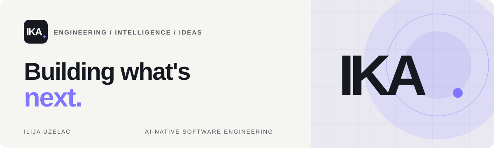

  

  

<h1 align="center">Ilija Uzelac</h1>

  <strong>Senior Software Engineer at Forwardslash</strong> 
  AI-Native &amp; Agentic Engineering · Software Architecture · Security

  <a href="https://lumenko.zova.rs">Website ↗</a> &nbsp;·&nbsp;
  <a href="https://linkedin.com/in/uzelac-iki">LinkedIn ↗</a>

---

## 🧭 Engineering with intent

I build **simple, secure, and lasting software**.

I'm a software engineer with **11+ years of experience** across SaaS platforms, backend architecture, API design, and technical leadership. My current work at **Forwardslash** sits alongside a growing focus on **AI-native engineering** — using intelligent tools and agentic workflows deliberately, without compromising software fundamentals.

## ⚙️ What I focus on

- 🏗️ **Architecture** — SaaS, distributed systems, domain modeling, REST and GraphQL.
- 🤖 **AI-native engineering** — AI-assisted development, agentic workflows, MCP, and responsible automation.
- 🛡️ **Security & reliability** — secure APIs, access control, threat modeling, observability.
- 🚀 **Delivery & leadership** — testing, CI/CD, maintainability, mentoring, and pragmatic technical decisions.

**Toolbox** · PHP / Laravel · JavaScript · MySQL / PostgreSQL · Docker · Linux · Cloud & DevOps

I'm not defined by a framework. **The problem determines the stack.**

## ✦ IKA — the next chapter

**IKA** is my personal digital space: a home for engineering, ideas, and the systems I'm building.

**01 / PUBLIC** → **02 / COMMUNITY** → **03 / PRIVATE OS**

The public website is live. A community layer and private, AI-powered owner workspace are part of the **long-term vision** — not launched products.

> Clarity over complexity. Build with intent. Keep evolving.

## 🌿 Beyond code

🐾 Animals · 🌱 Nature · 💡 Independent thinking · ✨ A simpler, more intentional life

---

  <strong>IKA · THINK / BUILD / EVOLVE ↗</strong> 
  <a href="https://lumenko.zova.rs">Explore IKA</a> &nbsp;·&nbsp;
  <a href="https://linkedin.com/in/uzelac-iki">Let's connect</a>

